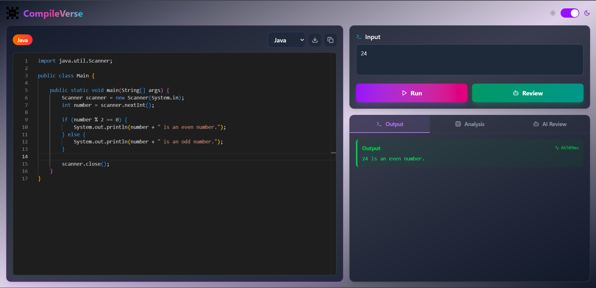

# CompileVerse ✨ - Your AI-Powered Coding Companion

[](https://reactjs.org/)
[](https://nodejs.org/)
[](https://expressjs.com/)
[](https://tailwindcss.com/)
[](https://gemini.google.com/)

CompileVerse is not just another online code compiler. It's an intelligent coding environment designed to help you write better, more efficient code by leveraging the power of Google's Gemini AI.

## 👁️ Live Preview

[](https://compileverse.vercel.app/)

---

## 📸 Project Screenshot

Here's a glimpse of CompileVerse in action:



---

## 🌟 Core Features

-   **Multi-Language Support**: Compile and run code in **Java, C++, Python, and C**.
-   **AI-Powered Complexity Analysis**: Instantly get the accurate **Time and Space Complexity** for every execution.
-   **AI Code Review**: Click "AI-Review" to receive an optimized version of your code, complete with its own complexity analysis. Learn best practices on the fly!
-   **User-Friendly Interface**:
    -   **Code Download**: Easily save your code files locally.
    -   **One-Click Copy**: Copy your code or the output with a single click.
    -   **Light & Dark Mode**: Switch between themes for your comfort.

## 🛠️ Tech Stack

-   **Frontend**: React, Tailwind CSS
-   **Backend**: Node.js, Express.js
-   **AI Integration**: Google Gemini API

## ⚙️ Getting Started

Follow these instructions to set up the project locally on your machine.

### Prerequisites

-   Node.js (v18 or later)
-   npm (or yarn)

### Installation

1.  **Clone the repository:**
    ```sh
    git clone https://github.com/Varni1512/CompileVerse.git
    cd CompileVerse
    ```

2.  **Setup the Backend:**
    ```sh
    # Navigate to the backend directory
    cd backend

    # Install dependencies
    npm install

    # Create a .env file in the /backend directory
    # and add your Gemini API key
    touch .env
    ```
    Your `.env` file should contain:
    ```
    GEMINI_API_KEY=YOUR_API_KEY_HERE
    ```
    ```sh
    # Start the backend server
    npx nodemon index.js
    ```
    The backend server will start on `http://localhost:8000`.

3.  **Setup the Frontend:**
    ```sh
    # Navigate to the frontend directory from the root
    cd frontend

    # Install dependencies
    npm install

    # Start the development server
    npm run dev
    ```
    The frontend will be available at `http://localhost:5173`.

## 🔮 Future Roadmap

-   **Fixie**: An interactive AI chatbot that guides you through coding problems. It will access your code to give hints and explanations without providing the final answer, acting as a true programming tutor.

## 🤝 Contributing

Contributions are welcome! Feel free to open an issue or submit a pull request to make CompileVerse even better.

---
Made with ❤️ by Varnikumar Patel
