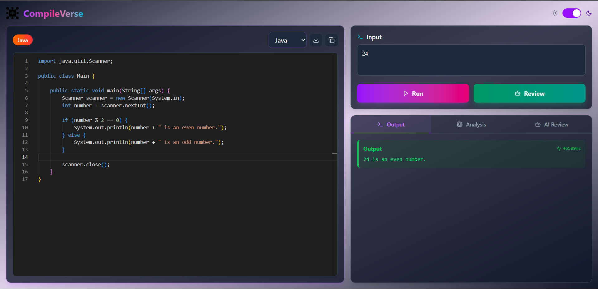

# CompileVerse ✨ - Your AI-Powered Coding Companion

[](https://reactjs.org/)
[](https://nodejs.org/)
[](https://expressjs.com/)
[](https://tailwindcss.com/)
[](https://www.docker.com/)
[](https://groq.com/)

CompileVerse is not just another online code compiler. It's an intelligent, full-fledged coding environment designed to help you write better, more efficient code by leveraging the power of Lightning-Fast AI and native compilation tools.

## 👁️ Live Preview

[](https://compileverse.vercel.app/)

---

## 📸 Project Screenshot

Here's a glimpse of CompileVerse in action:



---

## 🌟 Core Features

-   **Multi-Language Support**: Compile and run code natively in **Java, C++, Python, and C**.
-   **Multiple Test Cases**: Create multiple custom test cases with expected outputs to rigorously validate your algorithms in a single run.
-   **Native Backend Code Formatting**: Instantly clean up your code using industry-standard formatters (`black` for Python, `clang-format` for C/C++/Java) powered by our robust backend.
-   **AI-Powered Complexity Analysis**: Instantly get the accurate **Time and Space Complexity** for every execution.
-   **AI Code Review**: Click "Review" to receive an optimized version of your code, complete with its own complexity analysis and best practices.
-   **Advanced IDE UX**:
    -   **Auto-Save**: Your code is safely saved to your browser automatically as you type.
    -   **Shortcuts**: Hit `Ctrl + Enter` (or `Cmd + Enter`) to instantly run your code.
    -   **Editor Themes**: Choose from popular themes like Dracula, Monokai, GitHub Dark, and more.
    -   **Code Download**: Save your code locally with a single click.

## 🛠️ Tech Stack

-   **Frontend**: React, Tailwind CSS, Monaco Editor
-   **Backend**: Node.js, Express.js
-   **AI Integration**: Groq API (Lightning Fast LLaMA 3)
-   **Containerization**: Docker
-   **Formatters**: Black (Python), Clang-Format (C, C++, Java)

## 🚀 Getting Started

Follow these steps to get the project running on your local machine.

### **Step 1: Clone the Repository**
First, clone the project repository from GitHub and navigate into the project directory.

```sh
git clone https://github.com/Varni1512/CompileVerse.git
cd CompileVerse
```

### **Step 2: Set up the Backend (Docker Recommended)**
This method uses Docker to run the backend in a containerized environment, which includes all necessary compilers (C, C++, Java), runtimes (Python), and formatters (`black`, `clang-format`).

1.  **Navigate to the backend directory:**
    ```sh
    cd backend
    ```

2.  **Create a `.env` file:**
    ```sh
    touch .env
    ```
    Add your Groq API key to this file:
    ```
    GROQ_API_KEY=YOUR_API_KEY_HERE
    ```

3.  **Build and Run the Docker Container:**
    From inside the `backend` directory, run the following commands:
    ```sh
    # Build the Docker image
    docker build -t compileverse-backend .

    # Run the container from the image
    docker run -d -p 8000:8000 --env-file .env --name compileverse-backend-container compileverse-backend
    ```
The backend server will now be running at `http://localhost:8000`.

---
#### **Alternative: Run Manually**
This method requires you to have Node.js, GCC, G++, JDK, Python, `black`, and `clang-format` installed directly on your local machine.

1.  `cd backend`
2.  `npm install`
3.  Add `GROQ_API_KEY=YOUR_API_KEY_HERE` to `backend/.env`.
4.  `node index.js`

---
### **Step 3: Set up the Frontend**
After your backend is running, open a **new terminal window**.

1.  **Navigate to the frontend directory:**
    ```sh
    cd frontend
    ```
2.  **Install dependencies:**
    ```sh
    npm install
    ```
3.  **Start the development server:**
    ```sh
    npm run dev
    ```
The frontend will be available at `http://localhost:5173` and will seamlessly connect to your running backend.


## 🤝 Contributing

Contributions are welcome! Feel free to open an issue or submit a pull request to make CompileVerse even better.

---
Made with ❤️ by Varnikumar Patel
