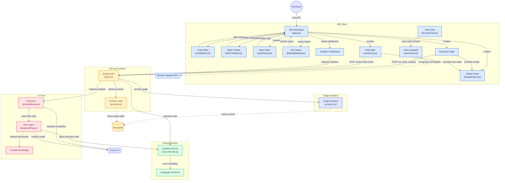

<div align="center">
  <h1>CompileVerse ✨</h1>
  <p><strong>Your AI-Powered Intelligent Code Companion & Autonomous Agentic IDE</strong></p>
  
  <p>
    <a href="https://reactjs.org/"></a>
    <a href="https://nodejs.org/"></a>
    <a href="https://expressjs.com/"></a>
    <a href="https://js.langchain.com/"></a>
    <a href="https://groq.com/"></a>
    <a href="https://tailwindcss.com/"></a>
    <a href="https://www.docker.com/"></a>
  </p>
  
  <p>
    <a href="https://compileverse.vercel.app/"></a>
  </p>
</div>

<hr />

## 📖 Overview

**CompileVerse** is an advanced, production-grade AI-powered online integrated development environment (IDE). Designed for software engineers, competitive programmers, and students, it elevates standard browser compilers into an **Autonomous Agentic Coding Assistant**.

Powered by a **LangChain Retrieval-Augmented Generation (RAG) pipeline**, **Groq LLaMA-3.3**, **Voice AI (STT & TTS)**, and **Sandboxed Native Execution Runtimes**, CompileVerse diagnoses runtime errors, calculates computational complexities, tests edge cases autonomously with tool calling, and provides verified, hallucination-free code tutoring.

---

## 🚀 Key Features

| Feature | Description |
| :--- | :--- |
| 📚 **LangChain RAG Knowledge Base** | Vector search over official C++ STL, Python, Java standard libraries, and DSA algorithmic patterns to ground AI tutoring in verified documentation. |
| 🎙️ **Voice AI Assistant (STT & TTS)** | Hands-free coding mentorship with real-time Speech-to-Text voice recognition and educational speech synthesis with natural audio filtering. |
| 🛠️ **Autonomous Agentic Tool Calling** | Equipped with LangChain function calling (`executeCodeTool`, `searchDocsTool`), enabling the AI to test code, verify outputs, and diagnose runtime bugs autonomously. |
| 🛡️ **Strict Mentor Guardrails** | Non-negotiable context and language boundaries: strictly declines cross-language drift and unrelated queries to prevent hallucinations. |
| 🎚️ **Draggable & Resizable Panels** | Vertical divider handle allowing smooth panel resizing and a 1-click collapse button to expand the AI Tutor to full 100% height. |
| 🌍 **Multi-Language Sandbox** | Write and execute code natively in **C++, Java, and Python** in isolated execution runtimes. |
| 🧠 **AI Code Review & Mentor** | Context-aware tutoring providing step-by-step hints, concept breakdowns, and bug diagnosis without spoon-feeding solutions. |
| ⏱️ **Complexity Analysis** | Instantly calculates and breaks down the **Time and Space Complexity** (Big-O notation) of your algorithm. |
| 🐞 **RAG-Backed Error Debugger** | Analyzes compiler errors, NPEs, segmentation faults, and out-of-bounds traps with corresponding official documentation fixes. |
| 📝 **Multi-Test Case Suite** | Validate algorithms against multiple custom inputs and expected outputs simultaneously with batch imports. |
| 🎨 **Advanced IDE Experience** | Powered by Monaco Editor, dynamic themes, keyboard shortcuts, fast copy, and one-click file download. |
| 🛡️ **Admin Analytics Dashboard** | Built-in analytics, per-IP rate limiting, and real-time execution metrics accessible via `#dashboard`. |

---

## 🏗️ System Architecture

CompileVerse operates on a modular, agentic client-server architecture:


```mermaid
flowchart TD

subgraph group_ide["IDE Client"]
  node_app["IDE Workspace<br/>[App.jsx]"]
  node_editor["Code Editor<br/>[CodeEditor.jsx]"]
  node_toolbar["Editor Toolbar<br/>[EditorToolbar.jsx]"]
  node_input["Input Panel<br/>[InputPanel.jsx]"]
  node_output["Output Panel<br/>[OutputPanel.jsx]"]
  node_bulk["Test Import<br/>[BulkAddModal.jsx]"]
  node_execution_hook["Execution State"]
  node_chat_hook["Chat State<br/>[useAiChat.js]"]
  node_voice["Voice Assistant<br/>[useVoiceAi.js]"]
  node_chat_ui["Tutor Chat<br/>[AiTutorChat.jsx]"]
  node_dashboard["Analytics Dashboard"]
end

subgraph group_api["API and Controls"]
  node_server["Express API<br/>[index.js]"]
  node_limits["AI Rate Limits<br/>[aiLimiter.js]"]
end

subgraph group_execution["Code Execution"]
  node_runner["Sandbox Runner<br/>[executeCode.js]"]
  node_runtime["Language Runtimes"]
end

subgraph group_tutor["AI Tutor"]
  node_review["AI Review<br/>[aiCodeReview.js]"]
  node_rag["RAG Agent<br/>[langchainRag.js]"]
  node_knowledge["Curated Knowledge"]
end

subgraph group_operations["Usage Analytics"]
  node_analytics["Usage Analytics<br/>[analytics.js]"]
end

node_developer(("Developer"))
node_groq{{"Groq LLM"}}
node_mongodb[("MongoDB")]
node_browser_speech{{"Browser Speech APIs"}}

node_developer -->|"uses IDE"| node_app
node_app -->|"renders"| node_editor
node_app -->|"renders"| node_toolbar
node_app -->|"renders"| node_input
node_app -->|"renders"| node_output
node_app -->|"opens import"| node_bulk
node_app -->|"invokes"| node_execution_hook
node_app -->|"invokes"| node_chat_hook
node_app -->|"shows dashboard"| node_dashboard
node_editor -->|"edits code"| node_app
node_toolbar -->|"sets language"| node_app
node_input -->|"sets input"| node_app
node_bulk -->|"imports cases"| node_app
node_execution_hook -->|"POST run, tests, analyze"| node_server
node_server -->|"executes code"| node_runner
node_runner -->|"runs in sandbox"| node_runtime
node_server -->|"requests analysis"| node_review
node_server -->|"checks AI quota"| node_limits
node_chat_hook -->|"POST review, fetch limits"| node_server
node_review -->|"uses RAG chat"| node_rag
node_review -->|"requests completion"| node_groq
node_rag -->|"indexes documents"| node_knowledge
node_rag -->|"invokes model"| node_groq
node_rag -->|"agent executes code"| node_runner
node_chat_ui -->|"uses voice controls"| node_voice
node_voice -.->|"recognizes and speaks"| node_browser_speech
node_dashboard -->|"requests statistics"| node_server
node_server -->|"records usage"| node_analytics
node_analytics -.->|"stores metrics"| node_mongodb
node_limits -.->|"stores quota state"| node_mongodb
node_execution_hook -->|"provides results"| node_output
node_chat_hook -->|"provides tutor state"| node_output

click node_app "https://github.com/varni1512/compileverse/blob/main/frontend/src/App.jsx"
click node_editor "https://github.com/varni1512/compileverse/blob/main/frontend/src/components/editor/CodeEditor.jsx"
click node_toolbar "https://github.com/varni1512/compileverse/blob/main/frontend/src/components/editor/EditorToolbar.jsx"
click node_input "https://github.com/varni1512/compileverse/blob/main/frontend/src/components/panels/InputPanel.jsx"
click node_output "https://github.com/varni1512/compileverse/blob/main/frontend/src/components/panels/OutputPanel.jsx"
click node_bulk "https://github.com/varni1512/compileverse/blob/main/frontend/src/components/modals/BulkAddModal.jsx"
click node_execution_hook "https://github.com/varni1512/compileverse/blob/main/frontend/src/hooks/useCodeExecution.js"
click node_chat_hook "https://github.com/varni1512/compileverse/blob/main/frontend/src/hooks/useAiChat.js"
click node_voice "https://github.com/varni1512/compileverse/blob/main/frontend/src/hooks/useVoiceAi.js"
click node_chat_ui "https://github.com/varni1512/compileverse/blob/main/frontend/src/components/chat/AiTutorChat.jsx"
click node_dashboard "https://github.com/varni1512/compileverse/blob/main/frontend/src/components/dashboard/AnalyticsDashboard.jsx"
click node_server "https://github.com/varni1512/compileverse/blob/main/backend/index.js"
click node_limits "https://github.com/varni1512/compileverse/blob/main/backend/aiLimiter.js"
click node_runner "https://github.com/varni1512/compileverse/blob/main/backend/executeCode.js"
click node_review "https://github.com/varni1512/compileverse/blob/main/backend/aiCodeReview.js"
click node_rag "https://github.com/varni1512/compileverse/blob/main/backend/langchainRag.js"
click node_knowledge "https://github.com/varni1512/compileverse/blob/main/backend/ragKnowledgeBase.js"
click node_analytics "https://github.com/varni1512/compileverse/blob/main/backend/analytics.js"

classDef toneNeutral fill:#f8fafc,stroke:#334155,stroke-width:1.5px,color:#0f172a
classDef toneBlue fill:#dbeafe,stroke:#2563eb,stroke-width:1.5px,color:#172554
classDef toneAmber fill:#fef3c7,stroke:#d97706,stroke-width:1.5px,color:#78350f
classDef toneMint fill:#dcfce7,stroke:#16a34a,stroke-width:1.5px,color:#14532d
classDef toneRose fill:#ffe4e6,stroke:#e11d48,stroke-width:1.5px,color:#881337
classDef toneIndigo fill:#e0e7ff,stroke:#4f46e5,stroke-width:1.5px,color:#312e81
classDef toneTeal fill:#ccfbf1,stroke:#0f766e,stroke-width:1.5px,color:#134e4a
class node_app,node_editor,node_toolbar,node_input,node_output,node_bulk,node_execution_hook,node_chat_hook,node_voice,node_chat_ui,node_dashboard,node_browser_speech toneBlue
class node_server,node_limits,node_mongodb toneAmber
class node_runner,node_runtime toneMint
class node_review,node_rag,node_knowledge toneRose
class node_analytics,node_developer,node_groq toneIndigo
```

### Core API Endpoints

- `POST /run` - Executes a single program and returns stdout/stderr with execution timing.
- `POST /run-tests` - Executes code against an array of test cases simultaneously.
- `POST /analyze` - Calculates Big-O Time & Space complexity.
- `POST /ai-review` - Triggers the LangChain RAG & Agentic Tool Calling pipeline.
- `POST /explain-error` - RAG-grounded compiler/runtime error explanation.
- `POST /api/admin/login` - Admin authentication for usage controls and rate limiting.

---

## 🛠️ Tech Stack & Dependencies

### Client Side
- **Framework**: React 18 (Vite)
- **Styling**: Tailwind CSS, Lucide Icons
- **Editor**: Monaco Editor (`@monaco-editor/react`)
- **Voice AI**: Web SpeechRecognition (STT), Web SpeechSynthesis (TTS)

### Server Side & AI Pipeline
- **Runtime**: Node.js v18+ & Express.js
- **AI Orchestration**: **LangChain** (`@langchain/core`, `@langchain/groq`)
- **LLM Engine**: **Groq API** (`llama-3.3-70b-versatile`)
- **RAG Architecture**: Vector Space TF-IDF / Cosine Similarity Retriever over curated official documentation
- **Database**: MongoDB (Mongoose) for rate limiting & execution analytics
- **Security & Sandbox**: Helmet, Express Rate Limit, isolated child process temp sandboxes

---

## ⚙️ Local Development Setup

To run CompileVerse locally:

### 1. Prerequisites
- [Git](https://git-scm.com/)
- [Node.js](https://nodejs.org/) (v18+)

### 2. Clone the Repository
```bash
git clone https://github.com/Varni1512/CompileVerse.git
cd CompileVerse/CompileVerse-main
```

### 3. Backend Setup
```bash
cd backend
npm install
```

**Configure Environment Variables (`backend/.env`):**
```env
PORT=8000
GROQ_API_KEY=your_groq_api_key_here
GROQ_MODEL_ID=llama-3.3-70b-versatile
MONGODB_URI=your_mongodb_connection_string
ADMIN_PASSWORD=admin123
```

**Start the Backend:**
```bash
npm run dev
# or: node index.js
```
*Backend runs on `http://localhost:8000`.*

### 4. Frontend Setup

Open a new terminal window:
```bash
cd frontend
npm install
npm run dev
```
*Frontend runs on `http://localhost:5173`.*

---

## 📜 License

This project is open-source and available under the MIT License.

---
<div align="center">
  <b>Designed and Developed with ❤️ by Varnikumar Patel</b>
</div>
